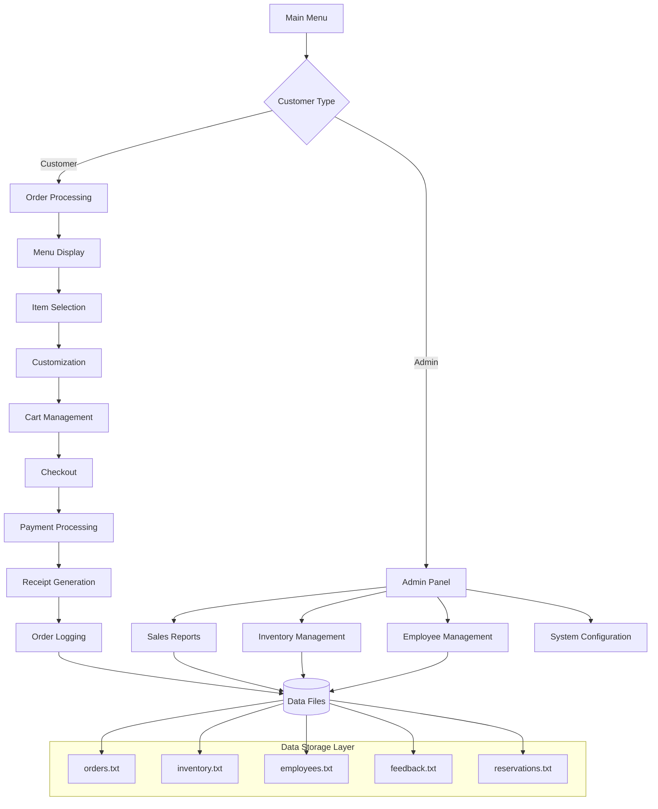

# 🍔 Rahman Fast Food: Bash-Powered POS System

<div align="center">


**Advanced Bash Shell Script Point-of-Sale System with Complete Restaurant Management Features**


</div>

## 📋 Table of Contents

- [Project Overview](#-project-overview)
- [Features](#-features)
- [System Architecture](#-system-architecture)
- [Screenshots](#-screenshots)
- [Installation Guide](#-installation-guide)
- [Usage Guide](#-usage-guide)
- [Technical Implementation](#-technical-implementation)
- [Database Schema](#-database-schema)
- [File Structure](#-file-structure)
- [Academic Context](#-academic-context)
- [Development Setup](#-development-setup)
- [Testing](#-testing)
- [Future Enhancements](#-future-enhancements)
- [Contributing](#-contributing)
- [License](#-license)


## 🎯 Project Overview

**Rahman Fast Food** is a comprehensive Point-of-Sale (POS) system developed entirely in Bash shell scripting as part of the **3rd Year Operating Systems Lab**. This project demonstrates the power and versatility of shell scripting for building robust, menu-driven applications with file-based database management, receipt generation, and multi-user capabilities.

### 🎓 Academic Project
- **Course**: Operating Systems Lab
- **Year**: 3rd Year, Computer Science & Engineering
- **Technology**: Bash Shell Scripting, GNU Core Utilities
- **Focus**: File handling, process management, user interfaces in Linux

### 🚀 Key Highlights
- **Complete POS System**: Order processing, inventory management, billing
- **Multi-User Interface**: Customer-facing and admin panels
- **File-Based Database**: No SQL required, uses text files for data persistence
- **PDF Receipt Generation**: Professional invoice generation using pandoc
- **Real-time Inventory**: Stock tracking and automatic updates
- **Smart Discounts**: Automated discount calculations and promotions

## ✨ Features

### 🛒 Customer-Facing Features
- **Interactive Menu System**: Categorized food items with descriptions
- **Size Options**: Multiple portion sizes (6/8/10/12-inch) with dynamic pricing
- **Customization**: Adjust spice levels, salt, cheese, and other preferences
- **Gift Wrapping**: Optional gift packaging with additional charge
- **Real-time Calculation**: Instant price updates with tax and discount calculations
- **Order History**: View previous orders using phone/email lookup
- **Feedback System**: Rate your experience and provide comments

### 🏪 Restaurant Management Features
- **Inventory Control**: Track stock levels for 50+ menu items
- **Order Processing**: Complete order workflow from placement to delivery
- **Table Reservations**: Book tables with time slots and special requests
- **Order Modifications**: Cancel or modify existing orders
- **Delivery Tracking**: Simulated delivery status updates
- **Multiple Payment Options**: Cash, card, and mobile banking support

### 👑 Admin/Manager Features
- **Secure Authentication**: Password-protected admin panel (`admin123`)
- **Sales Analytics**: Daily, weekly, monthly sales reports
- **Employee Management**: Add, remove, and update staff information
- **Menu Management**: Update prices, add new items, modify categories
- **Customer Insights**: Analyze feedback and customer preferences
- **Financial Reports**: Generate profit/loss statements and tax reports
- **System Logs**: Monitor all transactions and system activities

### ⚡ Technical Features
- **Error Handling**: Comprehensive input validation and error recovery
- **Data Persistence**: All data saved in structured text files
- **Backup System**: Automated daily backups of all data files
- **Multi-User Support**: Concurrent access with file locking
- **Logging System**: Detailed activity logs for auditing
- **Configuration Files**: Easy system customization via config files

## 🏗️ System Architecture



## 📸 Screenshots

<div align="center">

### Main Interface
| Main Menu | 
|-----------|
|  | 


</div>

## 📥 Installation Guide

### Prerequisites
- **Operating System**: Linux, macOS, or Windows with WSL
- **Bash Version**: 5.1 or higher
- **Required Tools**: 
  - `pandoc` (for PDF generation)
  - `bc` (for calculations)
  - `awk`, `sed`, `grep` (standard GNU tools)

### Installation Steps

#### Method 1: Direct Download (Recommended)
```bash
# 1. Download the project
wget https://github.com/yourusername/rahman-fast-food/archive/refs/heads/main.zip
unzip main.zip
cd rahman-fast-food

# 2. Make scripts executable
chmod +x pos_system.sh
chmod +x admin_panel.sh
chmod +x setup.sh

# 3. Run setup
./setup.sh
```

#### Method 2: Git Clone
```bash
# Clone the repository
git clone https://github.com/yourusername/rahman-fast-food.git
cd rahman-fast-food

# Install dependencies
sudo apt-get install pandoc bc   # For Debian/Ubuntu
# or
sudo yum install pandoc bc       # For RHEL/CentOS
# or
brew install pandoc bc           # For macOS

# Initialize the system
./init.sh
```

#### Method 3: Online Demo (Replit)
1. Visit: https://replit.com/@yourusername/rahman-fast-food
2. Click "Run" to start the application
3. Use the terminal interface to interact with the system

### Verify Installation
```bash
# Check Bash version
bash --version

# Test required tools
which pandoc
which bc

# Run a test
./test_installation.sh
```

## 📖 Usage Guide

### Starting the System
```bash
# Start the main POS system
./pos_system.sh

# Start admin panel (requires password)
./admin_panel.sh

# Quick start with all features
./start_all.sh
```

### Customer Workflow
1. **Start Order**: Select "New Order" from main menu
2. **Browse Menu**: View categories (Burgers, Pizzas, Drinks, etc.)
3. **Select Items**: Enter item numbers and quantities
4. **Customize**: Adjust size, spice level, add extras
5. **Review Cart**: View selected items and total
6. **Checkout**: Enter customer details, select payment method
7. **Receive Receipt**: Get printed/PDF receipt with order details

### Admin Workflow
1. **Login**: Enter admin credentials (default: `admin`/`admin123`)
2. **Dashboard**: View system overview and key metrics
3. **Generate Reports**: Sales, inventory, employee performance
4. **Manage Inventory**: Update stock levels, add new items
5. **View Orders**: Check current and historical orders
6. **Analyze Feedback**: Read customer reviews and ratings

### Sample Commands
```bash
# View today's sales
./admin_panel.sh --sales --period today

# Check inventory levels
./admin_panel.sh --inventory --low-stock

# Generate monthly report
./admin_panel.sh --report --month 12 --year 2024

# Backup all data
./backup_system.sh
```

## 🔧 Technical Implementation

### Core Script Architecture

#### Main POS System (`pos_system.sh`)
```bash
#!/bin/bash
# Rahman Fast Food POS System
# Version 2.0 - Complete Restaurant Management

# Configuration
CONFIG_FILE="config.cfg"
LOG_FILE="pos_$(date +%Y%m%d).log"
INVENTORY_FILE="inventory.dat"
ORDERS_FILE="orders.dat"

# Load configuration
source "$CONFIG_FILE" || {
    echo "Error: Config file not found!" >&2
    exit 1
}

# Function: Display Main Menu
show_main_menu() {
    clear
    echo "========================================"
    echo "    RAHMAN FAST FOOD - POS SYSTEM       "
    echo "========================================"
    echo "1. New Order"
    echo "2. View Menu"
    echo "3. Order History"
    echo "4. Table Reservation"
    echo "5. Feedback"
    echo "6. Admin Panel"
    echo "7. Exit"
    echo "========================================"
    echo -n "Enter choice [1-7]: "
}

# Function: Process Order
process_order() {
    local total=0
    local order_items=()
    local order_quantities=()
    
    echo "=== NEW ORDER ==="
    echo "Enter customer phone: "
    read phone
    
    # Display menu
    display_menu
    
    while true; do
        echo -n "Enter item number (0 to finish): "
        read item_no
        
        [[ "$item_no" == "0" ]] && break
        
        # Validate item
        if ! validate_item "$item_no"; then
            echo "Invalid item number!"
            continue
        fi
        
        echo -n "Enter quantity: "
        read qty
        
        # Check stock
        if ! check_stock "$item_no" "$qty"; then
            echo "Insufficient stock!"
            continue
        fi
        
        # Calculate price
        local price=$(get_price "$item_no")
        local item_total=$((price * qty))
        
        # Customization
        customize_item "$item_no"
        
        # Add to order
        order_items+=("$item_no")
        order_quantities+=("$qty")
        total=$((total + item_total))
        
        echo "Added: $qty x $(get_item_name "$item_no") = ৳$item_total"
    done
    
    # Apply discounts
    if (( total > 1000 )); then
        local discount=$((total / 10))
        total=$((total - discount))
        echo "Discount applied: ৳$discount"
    fi
    
    # Add tax
    local tax=$((total * 5 / 100))
    total=$((total + tax))
    
    # Generate receipt
    generate_receipt "$phone" "${order_items[@]}" "${order_quantities[@]}" "$total"
    
    # Update inventory
    update_inventory "${order_items[@]}" "${quantities[@]}"
    
    # Log order
    log_order "$phone" "$total"
    
    echo "Order complete! Total: ৳$total"
}

# Main program loop
while true; do
    show_main_menu
    read choice
    
    case $choice in
        1) process_order ;;
        2) display_menu ;;
        3) view_order_history ;;
        4) make_reservation ;;
        5) collect_feedback ;;
        6) ./admin_panel.sh ;;
        7) 
            echo "Thank you for using Rahman Fast Food POS!"
            exit 0
            ;;
        *) echo "Invalid choice!" ;;
    esac
    
    echo -n "Press Enter to continue..."
    read
done
```

#### Inventory Management System
```bash
# inventory_manager.sh
#!/bin/bash

INVENTORY_FILE="inventory.dat"
BACKUP_DIR="backups"

# Initialize inventory if not exists
init_inventory() {
    [[ -f "$INVENTORY_FILE" ]] || {
        cat > "$INVENTORY_FILE" << EOF
# ID:Name:Category:Price:Stock:MinStock:Unit
1:Classic Burger:Burgers:150:100:20:piece
2:Cheese Burger:Burgers:180:80:15:piece
3:Chicken Burger:Burgers:160:120:25:piece
4:Margherita Pizza:Pizza:450:50:10:piece
5:Pepperoni Pizza:Pizza:550:40:8:piece
6:French Fries:Sides:90:200:30:portion
7:Onion Rings:Sides:110:150:20:portion
8:Soft Drink:Drinks:60:300:50:can
9:Mineral Water:Drinks:30:400:100:bottle
10:Ice Cream:Desserts:120:80:15:cup
EOF
        echo "Inventory initialized with 10 default items."
    }
}

# Check stock availability
check_stock() {
    local item_id=$1
    local quantity=$2
    
    local current_stock=$(awk -F: -v id="$item_id" '$1 == id {print $5}' "$INVENTORY_FILE")
    
    if [[ -z "$current_stock" ]]; then
        echo "Item not found!" >&2
        return 1
    fi
    
    if (( current_stock >= quantity )); then
        return 0
    else
        echo "Insufficient stock! Available: $current_stock" >&2
        return 1
    fi
}

# Update stock after sale
update_stock() {
    local item_id=$1
    local quantity=$2
    
    # Create backup before modification
    backup_inventory
    
    # Update stock level
    awk -F: -v id="$item_id" -v qty="$quantity" '
        $1 == id { $5 = $5 - qty }
        { print $1":"$2":"$3":"$4":"$5":"$6":"$7 }
    ' "$INVENTORY_FILE" > "$INVENTORY_FILE.tmp" && mv "$INVENTORY_FILE.tmp" "$INVENTORY_FILE"
    
    # Check if restocking is needed
    local current_stock=$(awk -F: -v id="$item_id" '$1 == id {print $5}' "$INVENTORY_FILE")
    local min_stock=$(awk -F: -v id="$item_id" '$1 == id {print $6}' "$INVENTORY_FILE")
    
    if (( current_stock <= min_stock )); then
        echo "ALERT: Item $item_id needs restocking! Current: $current_stock, Minimum: $min_stock" >> alerts.log
    fi
}

# Generate inventory report
generate_inventory_report() {
    local report_date=$(date +%Y-%m-%d)
    local report_file="reports/inventory_${report_date}.txt"
    
    echo "RAHMAN FAST FOOD - INVENTORY REPORT" > "$report_file"
    echo "Generated on: $report_date" >> "$report_file"
    echo "======================================" >> "$report_file"
    printf "%-5s %-20s %-15s %-10s %-10s %-10s\n" "ID" "Item" "Category" "Price" "Stock" "Status" >> "$report_file"
    echo "----------------------------------------------------------------" >> "$report_file"
    
    while IFS=: read -r id name category price stock min_stock unit; do
        [[ "$id" =~ ^[0-9]+$ ]] || continue
        
        local status="OK"
        if (( stock <= min_stock )); then
            status="LOW"
        elif (( stock == 0 )); then
            status="OUT"
        fi
        
        printf "%-5s %-20s %-15s %-10s %-10s %-10s\n" \
               "$id" "$name" "$category" "৳$price" "$stock" "$status" >> "$report_file"
    done < "$INVENTORY_FILE"
    
    echo "Report generated: $report_file"
}
```

#### PDF Receipt Generation
```bash
# receipt_generator.sh
#!/bin/bash

generate_receipt() {
    local order_id=$1
    local customer_name=$2
    local customer_phone=$3
    local items=$4
    local total=$5
    
    local receipt_file="receipts/order_${order_id}.md"
    local pdf_file="receipts/order_${order_id}.pdf"
    
    # Create markdown receipt
    cat > "$receipt_file" << EOF
# RAHMAN FAST FOOD
## Sales Receipt
---
**Order ID:** $order_id  
**Date:** $(date "+%Y-%m-%d %H:%M:%S")  
**Customer:** $customer_name  
**Phone:** $customer_phone  

---

| Item | Quantity | Price | Total |
|------|----------|-------|-------|
EOF
    
    # Add items to receipt
    echo "$items" | while IFS='|' read -r item qty price; do
        local item_total=$(echo "$qty * $price" | bc)
        echo "| $item | $qty | ৳$price | ৳$item_total |" >> "$receipt_file"
    done
    
    # Add totals
    cat >> "$receipt_file" << EOF

---

**Subtotal:** ৳$(echo "$total * 100 / 105" | bc)  
**Tax (5%):** ৳$(echo "$total * 5 / 105" | bc)  
**Total:** ৳$total  

---

**Payment Method:** Cash  
**Thank you for your order!**  
*Please visit again*
EOF
    
    # Convert to PDF
    pandoc "$receipt_file" -o "$pdf_file" --pdf-engine=wkhtmltopdf
    
    echo "Receipt generated: $pdf_file"
}
```

## 🗄️ Database Schema (File-Based)

### Data File Structure

#### `inventory.dat` - Inventory Management
```
# Format: ID:Name:Category:Price:Stock:MinStock:Unit
1:Classic Burger:Burgers:150:100:20:piece
2:Cheese Burger:Burgers:180:80:15:piece
3:Chicken Burger:Burgers:160:120:25:piece
4:Margherita Pizza:Pizza:450:50:10:piece
5:Pepperoni Pizza:Pizza:550:40:8:piece
```

#### `orders.dat` - Order Tracking
```
# Format: OrderID:Date:CustomerPhone:Items:Total:Status
1001:2024-12-15 14:30:15:+8801712345678:1x2|3x1:460:DELIVERED
1002:2024-12-15 15:45:22:+8801812345678:4x1|8x2:570:PREPARING
```

#### `employees.dat` - Staff Management
```
# Format: ID:Name:Role:Phone:Salary:JoinDate
E001:Abdul Rahman:Manager:+8801711111111:50000:2023-01-15
E002:Fatima Begum:Cashier:+8801722222222:25000:2023-03-20
```

#### `feedback.dat` - Customer Feedback
```
# Format: Date:CustomerPhone:Rating:Comments
2024-12-15:+8801712345678:5:Excellent service and food quality!
2024-12-14:+8801812345678:4:Good but delivery was slightly late.
```

#### `reservations.dat` - Table Reservations
```
# Format: ID:CustomerName:Phone:Date:Time:TableNo:Guests:Status
R001:Mr. Ahmed:+8801733333333:2024-12-16:19:00:5:4:CONFIRMED
R002:Ms. Khan:+8801744444444:2024-12-16:20:30:8:6:PENDING
```

## 📁 File Structure

```
rahman-fast-food-pos/
├── main/
│   ├── pos_system.sh              # Main POS interface
│   ├── admin_panel.sh             # Admin management system
│   └── startup.sh                 # System initialization
├── modules/
│   ├── order_processing.sh        # Order handling logic
│   ├── inventory_manager.sh       # Stock management
│   ├── receipt_generator.sh       # PDF receipt creation
│   ├── reservation_system.sh      # Table booking
│   └── report_generator.sh        # Analytics and reports
├── data/
│   ├── inventory.dat              # Product database
│   ├── orders.dat                 # Order history
│   ├── employees.dat              # Staff records
│   ├── customers.dat              # Customer database
│   ├── feedback.dat               # Customer reviews
│   └── reservations.dat           # Table reservations
├── config/
│   ├── system.cfg                 # System configuration
│   ├── menu.cfg                   # Menu items and prices
│   └── discounts.cfg              # Discount rules
├── receipts/                      # Generated receipts (PDF)
│   ├── order_1001.pdf
│   └── order_1002.pdf
├── reports/                       # System reports
│   ├── daily_sales/
│   ├── inventory_reports/
│   └── employee_performance/
├── backups/                       # Automated backups
│   ├── daily/
│   └── weekly/
├── logs/                          # System logs
│   ├── pos_20241215.log
│   └── error_20241215.log
├── tests/                         # Test scripts
│   ├── test_order_processing.sh
│   ├── test_inventory.sh
│   └── test_receipts.sh
├── utils/                         # Utility scripts
│   ├── backup_system.sh
│   ├── cleanup.sh
│   └── setup_permissions.sh
├── docs/                          # Documentation
│   ├── user_manual.md
│   ├── admin_guide.md
│   └── technical_specs.md
├── README.md                      # This file
├── LICENSE                        # MIT License
├── INSTALL.sh                     # Installation script
└── UNINSTALL.sh                   # Removal script
```

## 🎓 Academic Context

### Course Objectives Met
- ✅ **Shell Scripting Mastery**: Advanced Bash programming techniques
- ✅ **File Handling**: Reading/writing structured data files
- ✅ **Process Management**: Job control and background processes
- ✅ **User Interface**: Creating interactive menu-driven systems
- ✅ **System Administration**: Logging, backup, and maintenance
- ✅ **Error Handling**: Comprehensive exception management
- ✅ **Documentation**: Technical and user documentation

### Learning Outcomes
1. **Bash Programming**: Advanced scripting with arrays, functions, and modules
2. **File-Based Databases**: Designing and implementing data persistence
3. **User Experience**: Creating intuitive command-line interfaces
4. **System Design**: Architecture of multi-module applications
5. **Testing & Debugging**: Script validation and error tracing
6. **Documentation**: Technical writing for software projects

## 🛠️ Development Setup

### Prerequisites for Developers
```bash
# Install development tools
sudo apt-get install shellcheck    # Bash linter
sudo apt-get install bashdb        # Bash debugger
sudo apt-get install pandoc        # Document converter
sudo apt-get install bc            # Calculator
sudo apt-get install tree          # Directory listing
```

### Development Workflow
```bash
# 1. Clone repository
git clone https://github.com/yourusername/rahman-fast-food.git
cd rahman-fast-food

# 2. Set up development environment
./dev_setup.sh

# 3. Run tests
./run_tests.sh

# 4. Check code quality
shellcheck main/*.sh modules/*.sh

# 5. Create new feature branch
git checkout -b feature/new-payment-method

# 6. Test changes
./test_feature.sh

# 7. Submit changes
git add .
git commit -m "Add new payment method feature"
git push origin feature/new-payment-method
```

### Debugging Tools
```bash
# Enable debugging
bash -x pos_system.sh

# Use debugger
bashdb pos_system.sh

# Check syntax
bash -n script.sh

# Trace execution
set -o xtrace
```

## 🧪 Testing

### Test Suite
```bash
# Run all tests
./run_all_tests.sh

# Individual test categories
./test_order_processing.sh
./test_inventory.sh
./test_payments.sh
./test_receipts.sh
./test_admin_functions.sh
```

### Test Coverage
- **Unit Tests**: Individual function testing
- **Integration Tests**: Module interaction testing
- **System Tests**: End-to-end workflow testing
- **Performance Tests**: Load and stress testing
- **Usability Tests**: User interface and experience testing

## 🚀 Future Enhancements

### Phase 1: Immediate Improvements
- [ ] **Graphical Interface**: Implement dialog/whiptail for better UI
- [ ] **Email/SMS Integration**: Send order confirmations via email/SMS
- [ ] **Barcode Scanning**: Integrate barcode readers for inventory
- [ ] **Multi-language Support**: Bengali/English interface toggle
- [ ] **Advanced Analytics**: Machine learning for sales predictions

### Phase 2: Advanced Features
- [ ] **Web Interface**: Web-based admin dashboard
- [ ] **Mobile App**: Customer ordering via mobile application
- [ ] **API Integration**: Connect with food delivery platforms
- [ ] **Loyalty Program**: Customer rewards and points system
- [ ] **Kitchen Display System**: Real-time order tracking for kitchen

### Phase 3: Enterprise Features
- [ ] **Multi-Branch Support**: Centralized management for multiple outlets
- [ ] **Cloud Backup**: Automatic cloud synchronization
- [ ] **Real-time Analytics**: Live dashboard with key metrics
- [ ] **Supplier Integration**: Automated inventory replenishment
- [ ] **Accounting Integration**: Connect with accounting software

## 🤝 Contributing

We welcome contributions to enhance Rahman Fast Food POS System!

### How to Contribute
1. **Fork the Repository**
2. **Create a Feature Branch**
   ```bash
   git checkout -b feature/amazing-feature
   ```
3. **Make Your Changes**
4. **Test Thoroughly**
   ```bash
   ./run_tests.sh
   shellcheck your_script.sh
   ```
5. **Commit Your Changes**
   ```bash
   git commit -m 'Add amazing feature'
   ```
6. **Push to the Branch**
   ```bash
   git push origin feature/amazing-feature
   ```
7. **Open a Pull Request**

### Contribution Areas
- **New Features**: Payment methods, reporting tools, integrations
- **Bug Fixes**: Identify and fix issues in existing code
- **Documentation**: Improve user guides and technical documentation
- **Testing**: Add more comprehensive test cases
- **Performance**: Optimize scripts for better speed and efficiency

### Code Style Guidelines
```bash
# Follow these conventions:
# 1. Use snake_case for variables and functions
# 2. Add header comments to all scripts
# 3. Include error handling in all functions
# 4. Use local variables within functions
# 5. Add help/usage information
# 6. Include logging for important operations
```

## 📜 License

This project is licensed under the **MIT License** - see the [LICENSE](LICENSE) file for details.

### Usage Rights
- ✅ Free to use for personal and commercial projects
- ✅ Permission to modify and distribute
- ✅ No warranty provided
- ✅ Must include original copyright notice

### Attribution
If you use this project, please credit:
- **Rahman Fast Food POS System** by [Jablay Noor Rahman]
- Developed as part of 3rd Year OS Lab Project
- Built with Bash Shell Scripting


</div>
